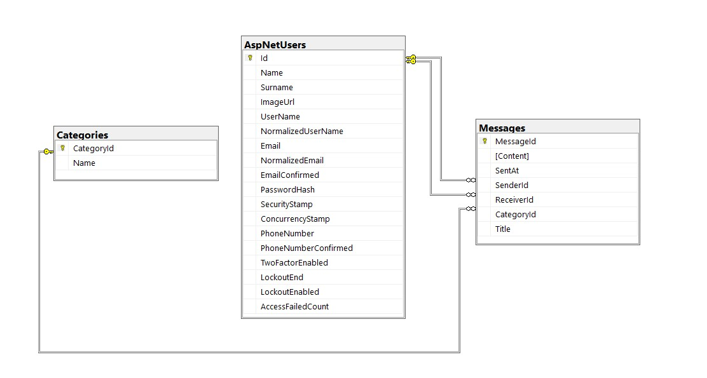
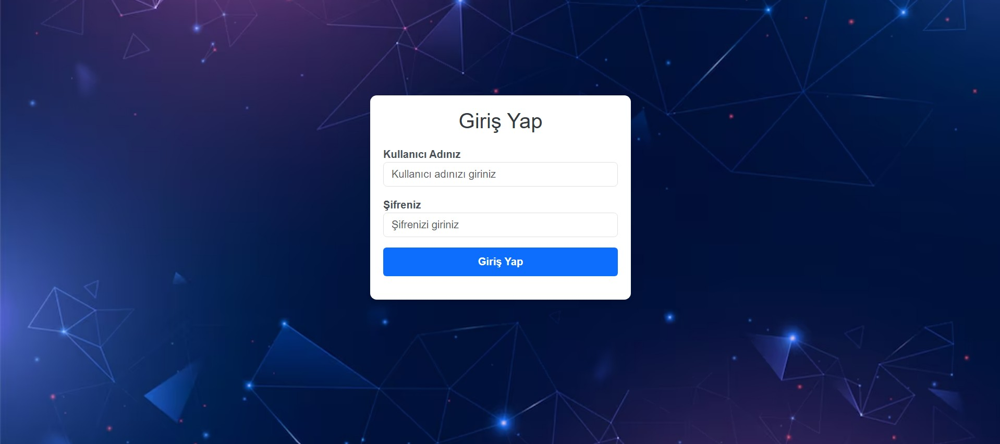
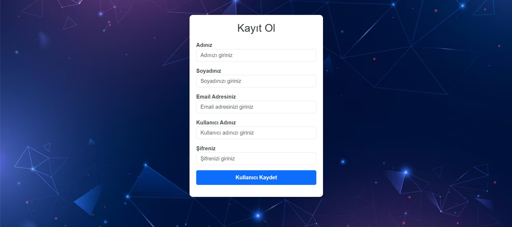
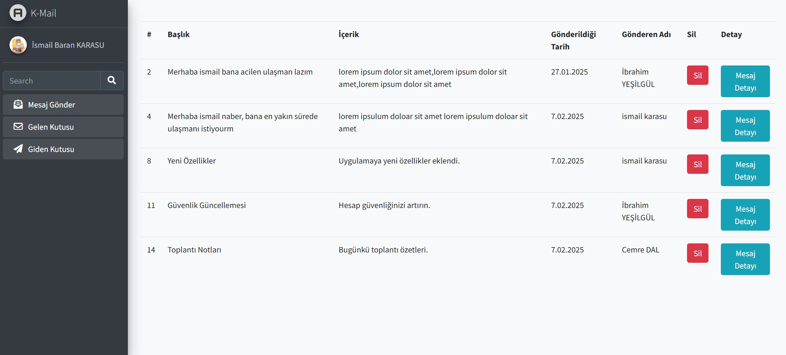
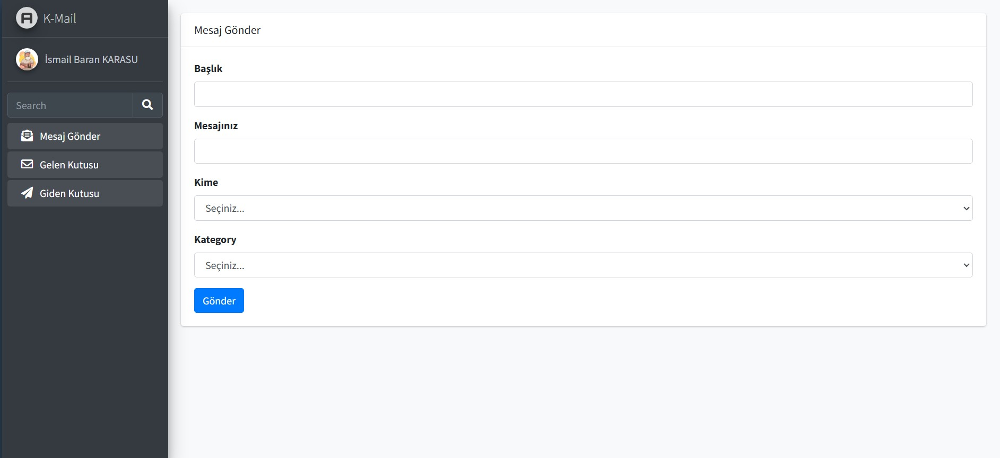
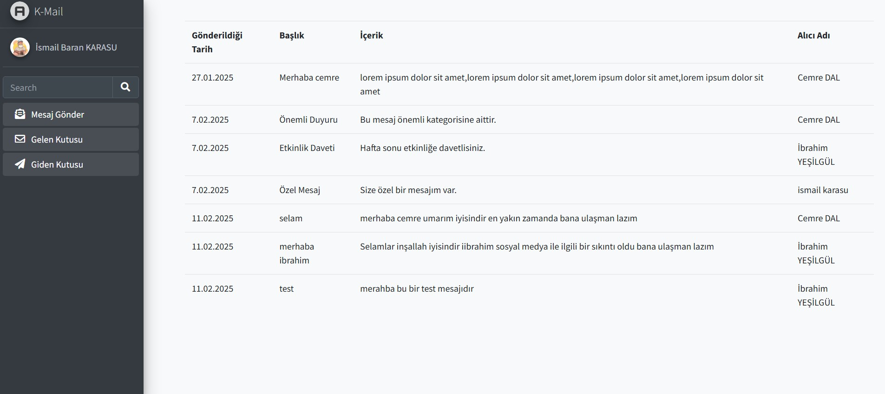

# MyIdentityChatApp 🚀

Herkese Merhaba 👋,

Bu projede **Identity** kullanarak, Gmail benzeri bir **web tabanlı mail uygulaması** geliştirdim. Kullanıcılar **Identity formatına uygun** şifreleriyle kayıt olup, diğer kullanıcılara mail gönderebilir, gelen ve gönderilen maillerini görüntüleyebilir. 📩

## 🔹 Teknolojiler & Yaklaşımlar:

- ✅ **.NET Core 6.0** – Güçlü ve modern bir backend yapısı
- ✅ **N Katmanlı Mimari** – Modüler ve yönetilebilir kod yapısı
- ✅ **ASP.NET Identity** – Güvenli kimlik doğrulama ve yetkilendirme
- ✅ **Repository Design Pattern** – Esnek ve sürdürülebilir veri erişimi
- ✅ **Dependency Injection** – Bağımlılıkları yöneterek daha temiz kod
- ✅ **SweetAlert** – Kullanıcı dostu bildirimler ve dinamik uyarılar

## 🔥 Bu projeyle öğrendiklerim:

- 🔹 **Identity** kullanımını anladım
- 🔹 **Dependency Injection** kullanımı konusunda kendimi geliştirdim


## Ekran Görüntüleri 📸

### Veri Tabanı


### Login Sayfası



### Admin Paneli Görüntüsü


### Gelen Mesajlar Görüntüsü


### Mesaj Gönder Görüntüsü


### Giden Mesajlar Görüntüsü



## Kurulum ⚡
1. Projeyi klonlayın:
   ```bash
   git clone https://github.com/ismailbarankarasu/MyIdentityChatApp.git

2. Proje klasörüne gidin:
    ```bash
    cd MyIdentityChatApp

3. Veritabanı yapılandırmalarını yapın ve SQL Server üzerinde çalıştırın.

4. Uygulamayı çalıştırın:
    ```bash
    dotnet run

## Katkıda Bulunma

Katkıda bulunmak isterseniz, lütfen bir **pull request** açın. Her türlü katkı memnuniyetle karşılanır.